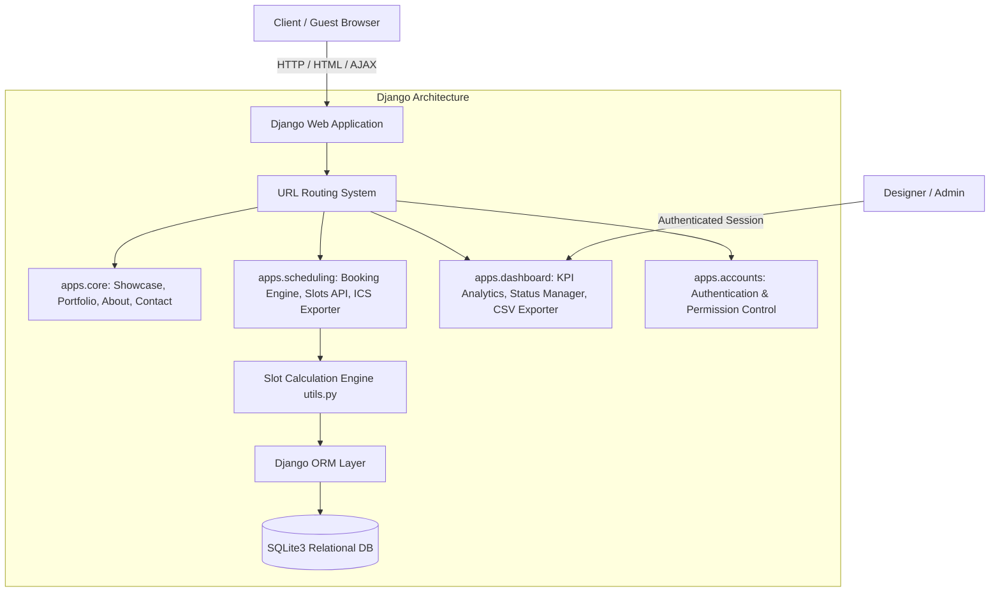

# James Graphic Design Studio — Personal Scheduling & Client Booking Platform

**Course**: SEN 310 — Software Engineering Architecture, Design & Implementation  
**Framework**: Python 3.13 / Django 6.1  
**Architecture**: Model-View-Template (MVT) + Decoupled REST Available Slot Calculation Engine

---

## 🎨 1. Executive Summary & Business Overview
This project is an end-to-end, production-ready **Personal Scheduling & Client Intake Web Application** engineered for **James Design Studio** — a premium graphic design and visual identity practice. 

The system eliminates scheduling friction and back-and-forth client emails by combining a high-impact design portfolio with an intelligent, dynamic calendar slot generation engine.

### Key Capabilities:
- **Interactive Portfolio Showcase**: High-resolution gallery featuring the studio's actual design work (*Clash of Crowns, NailedByDee Luxury Brand, Grill & Groove Event Flyer, DAWN Infographic, Orji Bond Campaign, Exam Prep Flyer, etc.*) with categorized filtering and modal lightbox previews.
- **Dynamic Slot Calculation Engine**: Real-time calculation of available consultation intervals based on designer working hours, lunch breaks, buffer periods, and active bookings with **strict double-booking prevention**.
- **Interactive 4-Step Booking Wizard**: Fast, frictionless scheduling experience capturing service package selection, real-time date/slot picking, and client design briefs with asset links.
- **Instant Calendar Synchronization**: Automatic RFC 5545 standard `.ics` file generation for one-click import into Google Calendar, Apple iCal, or Microsoft Outlook.
- **Client Self-Service Management Portal**: Lookup booking by unique reference (e.g., `DES-102938`) to view specifications, meeting links, reschedule dates/times, or cancel.
- **Designer Control Center & Dashboard**: Executive analytics (Revenue, Bookings count, Pending reviews, In Progress, Completed), filterable data table, status toggle modals, CSV export, and weekly working hours configurator.

---

## 🏗️ 2. Architectural Design & Pattern Analysis (SEN 310)



### Relational Database Model Schema:
1. **`Service`**: Name, slug, category, pricing, duration, buffer minutes, turnaround time, deliverables bullet list, icon, and gradient tokens.
2. **`PortfolioItem`**: Title, slug, category, client name, description, high-res image link, related service package, and tools used.
3. **`WorkingHours`**: Day of week (Mon-Sun), start time, end time, lunch break start/end, and day-off toggle.
4. **`Appointment`**: Unique booking reference (`DES-XXXXXX`), service FK, client details, design brief, brand moodboard links, target deadline, appointment date, start/end time, meeting format & link, status (`PENDING`, `CONFIRMED`, `IN_PROGRESS`, `COMPLETED`, `CANCELLED`, `RESCHEDULED`), and private designer internal notes.
5. **`Review`**: Rating (1-5 stars), client name, verified role, comment, and featured toggle.

---

## 🚀 3. Quick Start & Execution Guide

### Prerequisites
- Python 3.10+
- Django 5.0+ or 6.0+
- Pillow (for image handling)

### Installation Steps

1. **Navigate to the Project Directory**:
   ```bash
   cd C:\Users\James\.gemini\antigravity-ide\scratch\graphic_design_scheduler
   ```

2. **Install Dependencies**:
   ```bash
   pip install -r requirements.txt
   ```

3. **Apply Database Migrations**:
   ```bash
   python manage.py makemigrations
   python manage.py migrate
   ```

4. **Seed Sample Graphic Design Data**:
   Populate services, working hours, portfolio images, and sample appointments with a single command:
   ```bash
   python manage.py seed_data
   ```

5. **Start the Development Server**:
   ```bash
   python manage.py runserver 8000
   ```
   Open your browser and navigate to: **`http://127.0.0.1:8000/`**

---

## 🔑 4. Demo User Accounts & Testing Credentials

| Role | Username | Password | Purpose |
| :--- | :--- | :--- | :--- |
| **Studio Owner / Designer** | `admin` | `admin123` | Full access to Designer Dashboard, status updater, availability settings, and Django admin |
| **Guest / Client** | *None required* | *None required* | Direct public access to book services, view portfolio, and look up existing bookings |

### Sample Pre-Configured Booking Reference Codes for Testing:
- **`DES-102938`** (Dee Adebayo - NailedByDee Luxury Brand Identity - Completed with Review)
- **`DES-772914`** (Dr. Kemi Balogun - DAWN Health Infographics - Confirmed Upcoming)
- **`DES-892104`** (Hon. Orji Bond Committee - Campaign Publicity Suite - In Progress)
- **`DES-339201`** (Samuel Croft - Clash of Crowns Social Media Pack - Pending)

---

## 🧪 5. Automated Unit Tests

Run the full automated test suite covering models, available slot calculation, double-booking prevention, ICS export, and dashboard security:
```bash
python manage.py test
```
*Result: 7 tests passed (0 failures, 0 errors).*
